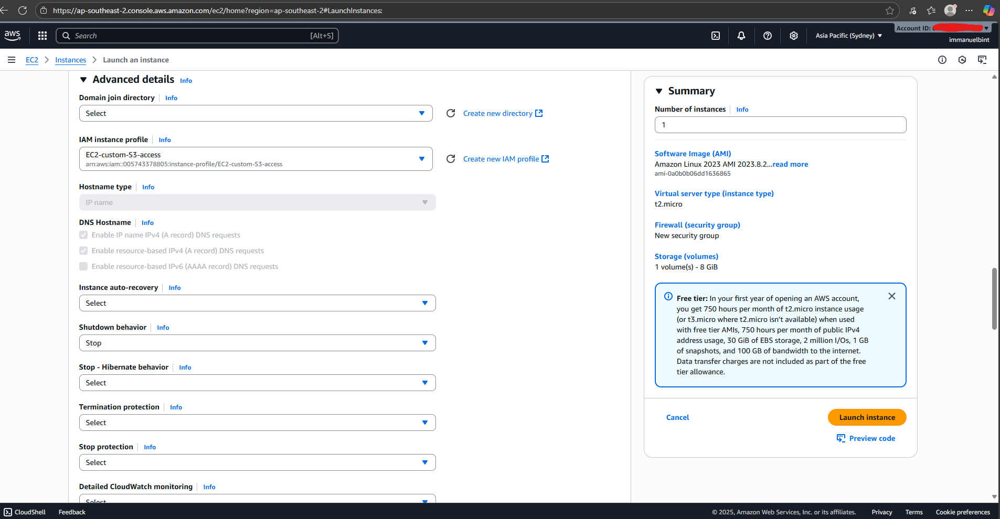

# Basic infra with EC2 + S3 + IAM

In this hands-on lab, I’m practicing how to deploy basic infrastructure with AWS EC2 and configure IAM roles to securely upload/retrieve files from an S3 bucket.

## Architecture Diagram


## Requirement
- AWS Account
- User that has permission to
    - Launch EC2 instance
    - Create S3 bucket
    - Manage IAM roles and policies

## Step 1: Create S3 Bucket

1. Press **Alt+S** to open the search bar, and type **S3**.
   

2. In the S3 dashboard, click **Create bucket**.
   

3. Enter a unique bucket name (e.g., `my-lab-bucket`), leave other settings as **default**.
   
   

### Notes:
- **Versioning**: Disabled by default. Enable if you want file history/rollback.
- **Tags**: Useful for cost tracking & billing in real projects.
- **Encryption**: Disabled by default. In production, enable SSE-S3 or SSE-KMS.
- **Block Public Access**: Enabled by default (recommended for security).

## Step 2: Create EC2 Instance

1. Search for EC2 → go to Instances → click Launch instance

    

2. Name the instance, select Amazon Linux as the OS

    

3. Choose t2.micro (free tier eligible).
4. Create a new key pair (RSA, .pem format for Linux/modern Windows).

    

6. Create a Security Group → allow SSH (22) and HTTP (80).

    

## Step 3: Create a Custom IAM Policy

Instead of using AmazonS3FullAccess, create a least-privilege policy:

1. Go to IAM -> Policies -> Create Policy

    

2. Paste JSON (update bucket name to match your S3 bucket):

```json
{
  "Version": "2012-10-17",
  "Statement": [
    {
      "Effect": "Allow",
      "Action": [
        "s3:PutObject",
        "s3:GetObject"
      ],
      "Resource": "arn:aws:s3:::my-lab-bucket/*"
    }
  ]
}
```


3. Review & name the policy (e.g., DemoAmazonS3Policies).


## Step 4: Create IAM Role for EC2

1. Go to IAM → Roles → Create role.

2. Choose AWS service → EC2.


3. Attach the custom policy created earlier.


4. Name the role and add description.


## Step 5: Attach Role and User Data to EC2

1. Back in Launch instance → Advanced details, attach the IAM Role.



2. Add User data script (user_data.sh) to install Apache web server:

```bash
#!/bin/bash
# This script will be exectued only on first instance launch

# Install web server and adding index.html
yum update -y
yum install -y httpd

systemctl enable --now httpd

echo "Hello World, from $(hostname -f)" > /var/www/html/index.html
```


3. Review & Launch the instance.
4. Verify → open EC2 Public IPv4 in browser → should display Hello World.


## Step 6: Test Upload and Get file to S3 Bucket

1. Connect to instance (SSH / EC2 Instance Connect).

    

2. Verify AWS CLI:

```bash
aws --version
```

3. Create a sample file:

```bash
 echo "Hello world from $(hostname)" > hello.txt
```

4. Upload to S3:

```bash
aws s3 cp test.txt s3://mybucket-immanuelbint/
```


5. Retrieve file back:

```bash
aws s3 cp  s3://mybucket-immanuelbint/test.txt .
```


## Lesson Learned

- IAM Least Privilege → Never attach AmazonS3FullAccess directly to an EC2 instance. Always create a custom policy that only grants required actions (GetObject, PutObject) for a specific bucket.
- Security Groups → Open only the necessary ports (e.g., SSH, HTTP). Avoid using 0.0.0.0/0 in production environments.
- User Data → Useful for bootstrapping instances (installing packages, configuring applications) at launch.
- S3 Default Settings → Block Public Access and Encryption are disabled by default. In production, these should be reviewed and adjusted for compliance and security.
- Upload & Retrieve Practice → Using IAM Roles for EC2 is more secure than embedding AWS Access Keys.
- Hands-on Value → Even a simple lab already covers fundamental AWS services (EC2, S3, IAM, SG), which are the backbone of most cloud architectures.

## Reference

- AWS Udemy Course by Stephane Maarek
- [AWS official docs](https://docs.aws.amazon.com/AWSEC2/latest/UserGuide/EC2_GetStarted.html)