## **CloudWatch Alarm Lab**

In this hands-on lab, I’m practicing how to create and configure a CloudWatch alarm that can automatically take an action if an EC2 instance goes into an alarm state.

## Requirement

- AWS Account
- User with permissions to:
    - Create EC2 instances
    - Create Cloudwatch alarm
    - (optional) manage EC2 termination / recovery actions

### Objectives

* Launch EC2
* Setup Cloudwatch alarm on `CPUUtilization`
* Simulate high CPU load until alarm is triggered

## Step 1: Create EC2

1. Go to EC2 Dashboard → Launch Instance.
2. Use Amazon Linux 2 (t2.micro) (Free Tier eligible).
3. Configure Security Group → allow SSH (22).

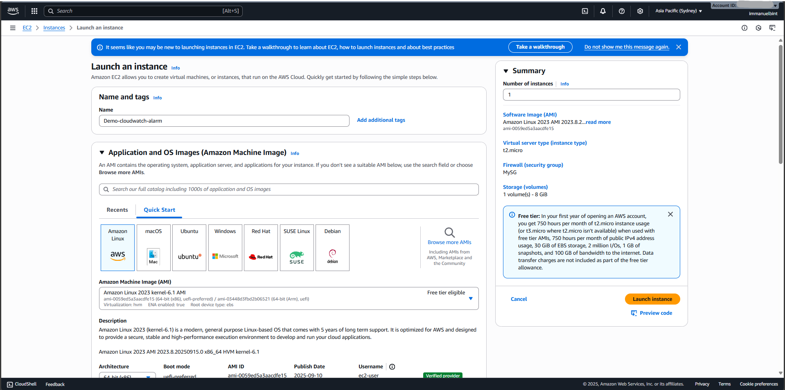

4. Launch and connect to the instance.

## Step 2: Create CloudWatch Alarm

1. Go to CloudWatch → Alarms → Create alarm.

2. Choose EC2 Metrics → Per-Instance Metrics → CPUUtilization.

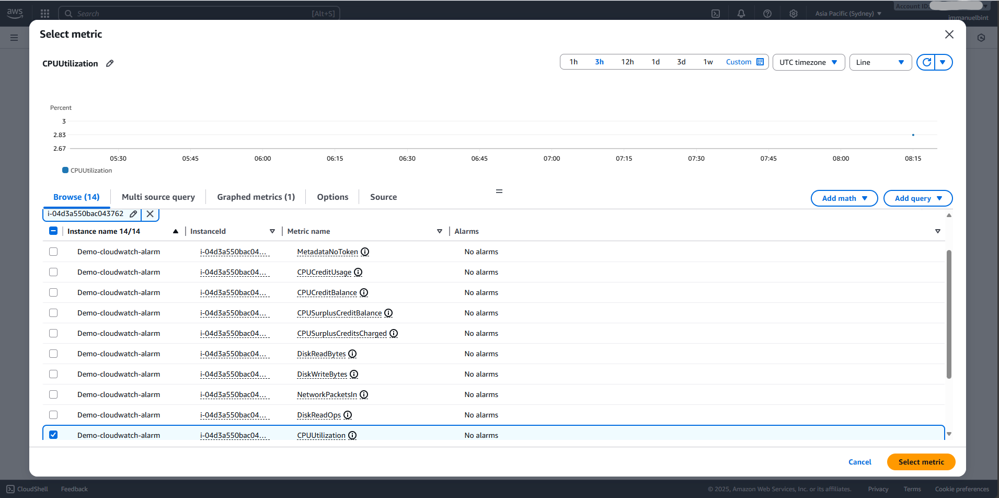

3. Set condition:
- Threshold: Greater than 90%
- Period: 2 minute

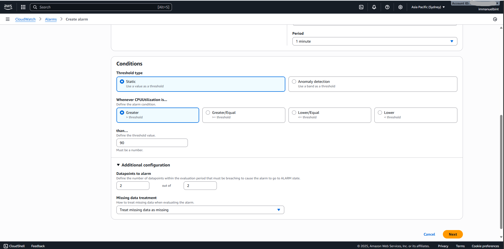

4. Select an action:
- For demo: Terminate instance (careful, this will delete the instance).
- Alternative: Send notification via SNS.

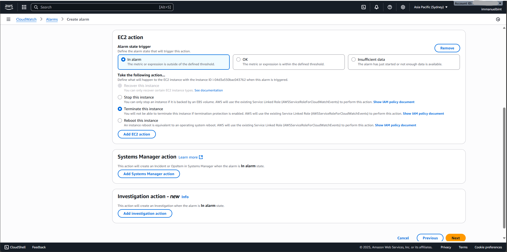

5. Name the alarm (e.g., HighCPUAlarm) and create it. 

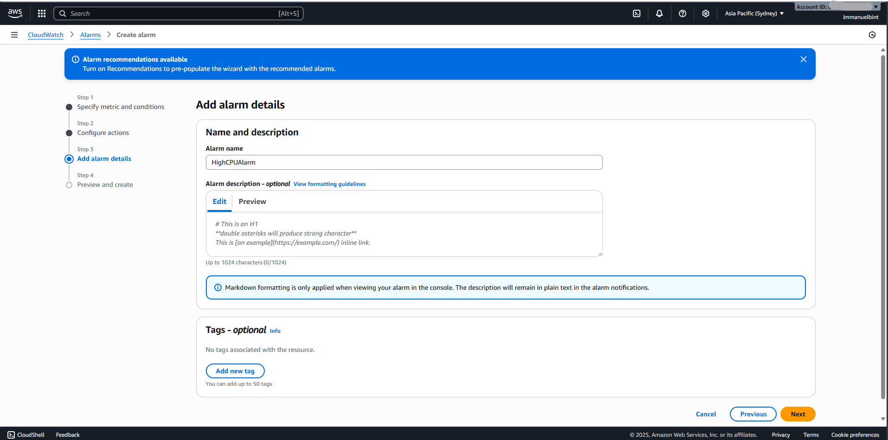

## Step 3: Simulate high CPU usage

1. Install `stress` tool on EC2 instance

Amazon Linux / CentOS / RedHat

```bash
sudo yum install -y stress
```

Ubuntu/Debian:

```bash
sudo apt-get update
sudo apt-get install -y stress
```

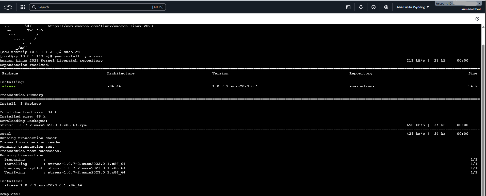

2. Run stress test for 10 minute

```bash
stress --cpu 2 --timeout 600
```

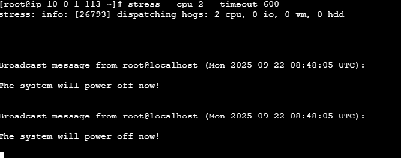

3. Within a few minutes, CPUUtilization > 90% → alarm state changes to ALARM.

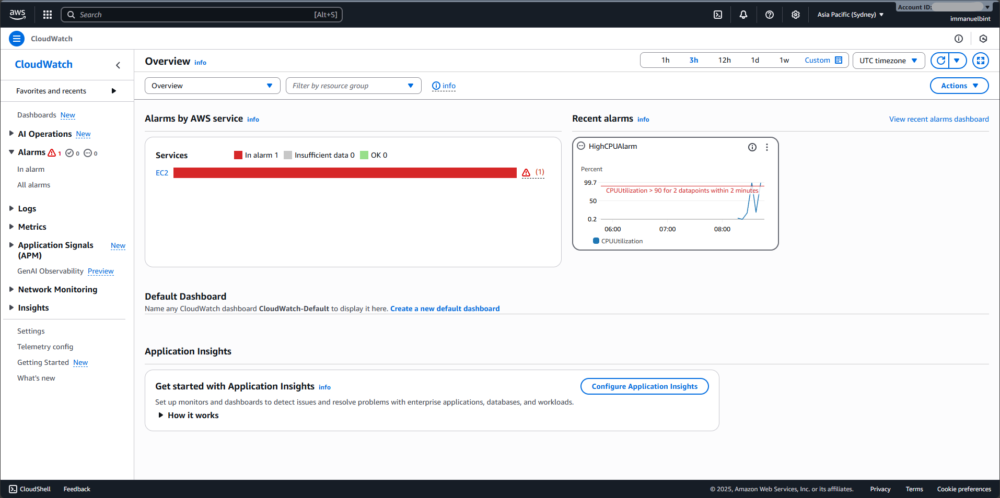
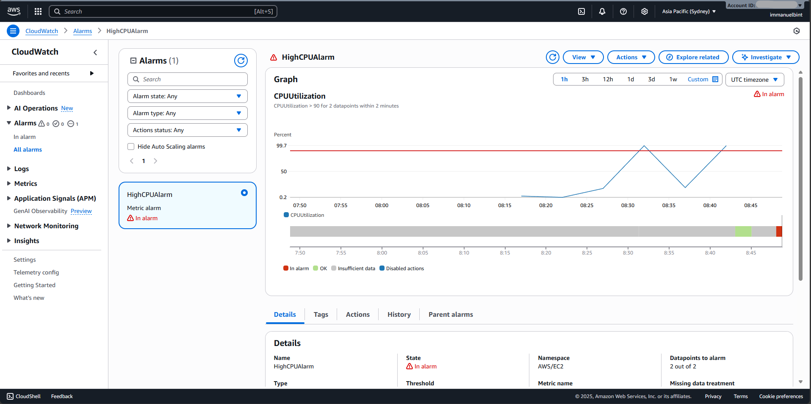

4. Verify: CloudWatch alarm takes the configured action (terminate instance or send notification).

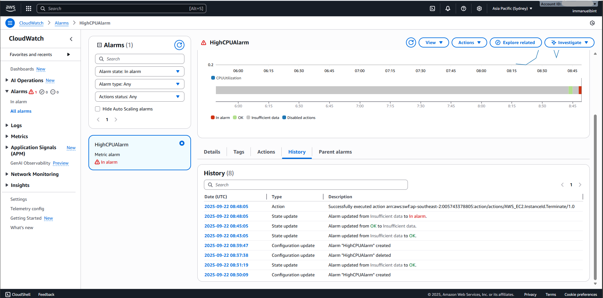
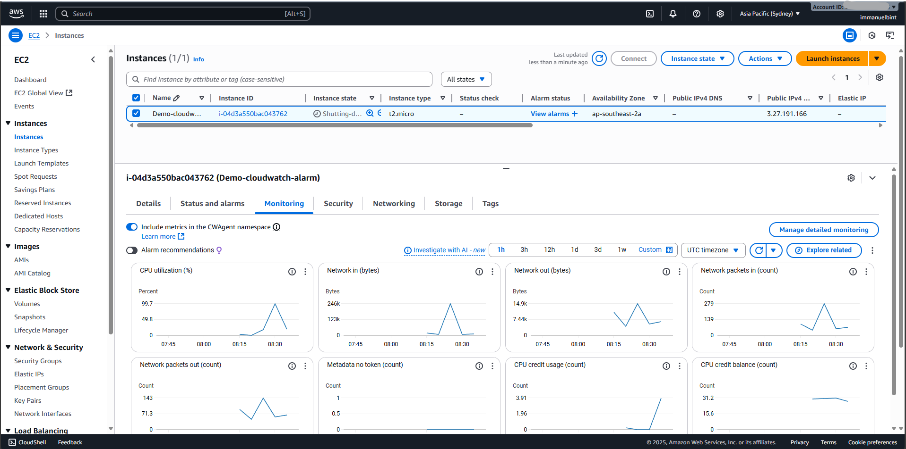
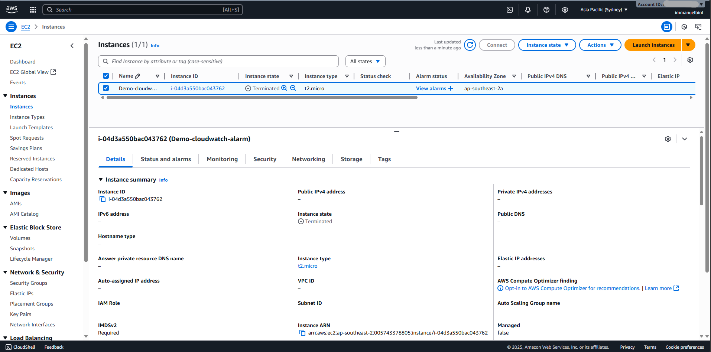

## Lesson Learned

- CloudWatch alarms help monitor resources and automate actions when thresholds are breached.
- For testing:
    - Use stress to generate real metric load (recommended).
    - Or use aws cloudwatch set-alarm-state to manually simulate alarm for notification testing.
- Be cautious with Terminate action in production, prefer Recover or Notify.