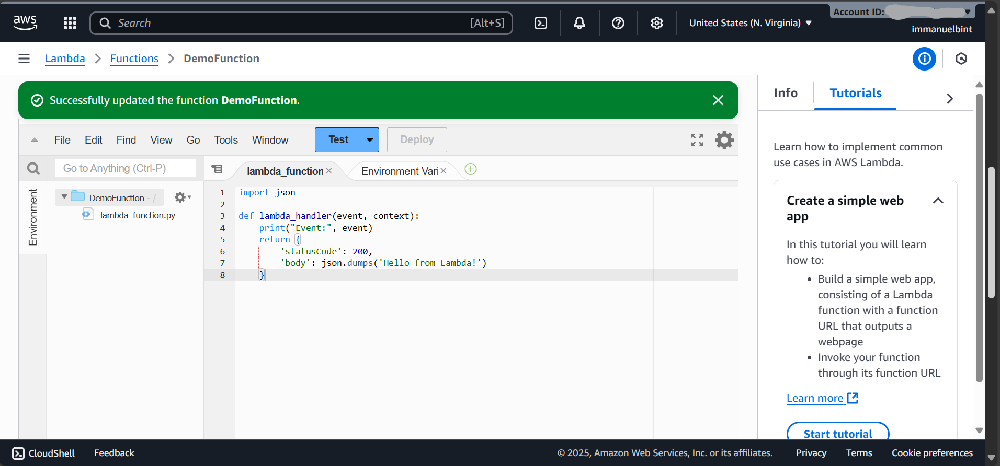

# AWS Lambda Automation Lab

In this hands-on lab, I’m practicing how to use AWS Lambda for automation. I’ll create Lambda functions, attach event triggers, and monitor logs to understand serverless workflows.

## Architecture Diagram

(example flow: S3 → Lambda → SNS)

## Requirements

- AWS Account
- User with permissions to:
    - Create Lambda functions
    - Create IAM roles for Lambda execution
    - Configure event sources (e.g., S3, CloudWatch Events)
    - Access CloudWatch Logs

## Objectives

- Create a basic Lambda function
- Attach IAM role for execution permissions
- Configure event triggers (S3 upload, CloudWatch schedule, or API Gateway)
- Validate execution and view logs in CloudWatch

## Step 1: Create Lambda Function

1. Go to Lambda -> Create function -> Author from scratch

2. Runtime: Python 3.13 (or Node.js, depends on preference)


3. Execution role: crate new role with basic Lambda permissions


4. Example function (Hello World):

```python
import json

def lambda_handler(event, context):
    print("Event:", event)
    return {
        'statusCode': 200,
        'body': json.dumps('Hello from Lambda!')
    }
```



## Step 2: Add Event Trigger

Create S3 Event Trigger

1. Create an S3 bucket, and enable event notification for PUT (object created)


2. Set destination to Lambda function


## Step 3: Test the Function

S3 trigger

1. Upload a file to the bucket -> check Lambda execution in `CloudWatch Logs`


## Step 4: Monitor with CloudWatch Logs

1. Go to `CloudWatch` -> `Logs` -> `Log groups`

2. Search your lambda function's log group (e.g., /aws/lambda/DemoFunction)

3. Validate print/debug output


## Lesson Learned

- Lambda enables event-driven automation without managing servers
- Always attach the least-privilege IAM role to Lambda
- Event sources (S3, EventBridge, API Gateway, DynamoDB Streams) make Lambda powerful
- CloudWatch Logs are critical for debugging and monitoring Lambda executions
- Keep functions lightweight; split logic into multiple Lambdas for scalability

## References

- AWS Official Docs: [Getting Started with Lambda](https://docs.aws.amazon.com/lambda/latest/dg/getting-started.html)
- AWS Lambda Blueprints in Console